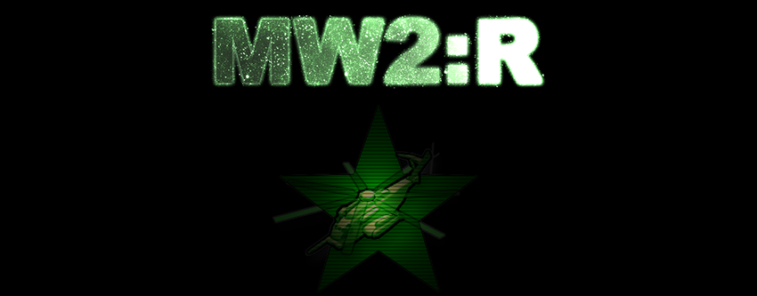

# MW2: Reimagined Zombies

Link to the original repository on [Gitlab]([https://gitlab.com/mw2-r-public/mw2r-iw4x-zombies-mod-public/-/releases](https://gitlab.com/mw2-r-public/mw2r-iw4x-zombies-mod-public)).

Download the public version of our zombie mode for AlterWare IW4x [here](https://gitlab.com/mw2-r-public/mw2r-iw4x-zombies-mod-public/-/releases).

# Summary

**MW2: Reimagined** is a project that aims to improve the multiplayer experience of Modern Warfare 2 by rebalancing everything from the ground up and adding new content to create an unique experience.

**MW2: Reimagined Zombies** is a custom game mode that brings Treyarch's popular zombies mode known from other Call of Duty titles such as World at War and Black Ops 1 to the world of Modern Warfare 2.

Many mechanics have been made to function very close to how they work in Black Ops 1:
- Mystery Box
- Tactical Grenades (inside Mystery Box)
- Wall Weapons
- Wall equipment (such as Claymores and the Bowie Knife)
- Pack a Punch
- Perk Machines
- Power ups
- Windows and Barriers
- Amount of enemies per round
- Health of zombies and hellhounds per round
- Special rounds
- Wonder Weapons such as the Thundergun or Wunderwaffe DG2
- **The perk Double Tap actually increasing your fire rate!**

This game mode was designed to be played by up to 8 players total. If you play with more than 8 players then bugs and stability issues are to be expected!

Compared to any of the other zombie mods that had been developed for Modern Warfare 2 until now, the zombies in our custom game mode are capable of navigating through complex map environments including jumping and climbing places, allowing them to hunt down players no matter where they are!

We also did our best to deliver everything as high quality as possible so it doesn't feel like a mod but as part of the game!

## IW4x Edition

We have developed an open source version for IW4x that will be fully available to the public.
That means anyone can download, play and modify this version for IW4x.

#### Weapon Limitations
It includes all base game weapons with vanilla stats **(all weapons still have the same move speed percentages as their MW2:R counterparts for balance purposes!)** and all IW4x specific custom weapons (with some small improvements such as added support for Acog Sights to the Dragunov and M40A3 for example).

Most of our custom weapons have been removed. With the exception of the **M1911**, **Raygun**, **Thundergun** and the **Wunderwaffe DG2** still being in the game with our custom stats.

On top of that, most upgraded weapons are very basic and do not feature any cool effects that make every weapon unique like in our full version. With the exception of the **Famas** and **F2000**, they kept their unique effects.

#### Map Limitations
Both maps from our previous showcases are supported: **Nacht der Untoten** and **Der Riese** remain fully available and playable. They have no limitations added to them, with Der Riese still featuring its music easter egg.

#### Power Up Limitations
All power ups that are featured in our full version are supported, with the exception of our custom "Max Armor" power up. IW4x does not feature an armor system, so it would do nothing here.

#### Perk Limitations
All perks mostly remain the same as in our full version. With the exception of Quick Revive and Juggernog. Quick Revive no longer provides a faster health regeneration. Juggernog no longer provides any bonus max armor.

#### Zombie AI Limitations
The AI for the zombies has been severely cut down to the point it is just about enough for the zombies to fully function properly. Since zombies do not use ranged weapons and the fact that they always know where you are, they simply did not need any of the advanced features our AI supports.

#### Modding
With this IW4x mod being open source, of course any skilled modder could pick this up and bring back all the content that we have changed or removed. Or add any new content that our full version does not have, such as new maps, weapons, enemies, perks and more.

If a modder adds something cool to this mod, then they could submit their changes to us and if these changes are good enough, they could likely be added to our full version! With full credits of course and possibly an exclusive contributor weapon dedicated to the person, depending on how much of a change the submission brings.

# Feature Showcase
The following part is a detailed description and showcase of most features that this mod includes.

## Zombie Types
The zombie mode currently supports 2 zombie types:
- Normal Zombies
- Hellhounds
 Normal zombies spawn throughout normal rounds, while hellhounds spawn in special rounds. With the exception of Der Riese, where they start spawning along with normal zombies at round 17 and onwards.

 Hellhounds also have a 50% chance to be on fire, causing them to explode when killed.

## Zombie AI
#### Zombies break windows and climb through them:

#### Zombies can attack through windows:

#### The last zombie can become enraged, starting at round 4:
 This is a feature seen in Black Ops 1.

#### Zombies can climb up and jump down specific spots:

#### Zombies can navigate through complex map environments:

### Tactics - Zombies prioritize players in direct line of sight:
 This allow you to strategize with team mates! In this example we are in Der Riese hiding on the catwalk out of sight, while our team mate keeps them distracted!

 Tip: Lock-on launchers like the Javelin, Stinger and AT4 can lock onto zombies!

 Don't be too ambitious when doing this though, otherwise the zombies might see you and you will be in trouble!

## Zombie Mechanics
#### Killing a zombie in different ways awards different kinds of points:
- Damaging a zombie by any means always awards 10 points
- Killing a zombie in general awards 50 points
- Killing a zombie with a headshot awards 100 points
- Killing a zombie with a melee attack or through a friendly zombie awards 130 points

#### Headshots:
- Headshots deal 400% (x4) damage to zombies using most weapons
- Headshots with snipers deal 1000% (x10) damage to zombies
- Projectile weapons and grenades do not benefit from headshots
  - However: Even if it deals no bonus damage, killing a zombie with a headshot using such a weapon still awards the same points

#### Explosives:
- Flash Grenades can stun zombies for up to 5 seconds
- Explosive weapons do not create crawlers, they don't exist here.
- If a player damages himself using explosive weapons, they will deal 1% of what they do to zombies as self inflicted damage, with a maximum cap of 25 damage
  - This damage cap is further halved if the weapon in question has been upgraded, leading to a lower cap of 12 damage
  - This leads to explosive weapons becoming extremely forgiving to use, making them way more usable and extremely powerful on maps that don't have the perk PHD!

### Collision:
- Due to engine limitations, zombies have no collision, that means you can run through them.
- The game mode is balanced around zombies having no collision that blocks you.
- Running through zombies should still only be a final, desperate option if you have no other choices.
  - Running through a zombie has a very high likelihood of you getting hit, depending on how fast you move with the weapon you are holding.

#### Attacks from zombies can be dodged if timed right:

#### Zombies have a pretty reliable headshot hitbox:

#### Zombies start to become sprinters at round 26:
 ALL Zombies become sprinters starting at round 31!

## Hellhounds
Hellhounds are very fast compared to normal zombies, but to compensate for their speed they have less health and deal less damage.
Every hellhound that spawns on the map has a 50% chance to be set on fire, causing explosion damage when they die.
Hellhounds also feature a custom hitbox. There is room for improvement, but it's good enough for now.

#### Hellhounds spawning during special round:

#### Burning hellhounds exploding:

#### Max Ammo awarded after the special round ends:

#### Hellhounds spawning during normal rounds on Der Riese:
 For each normal zombie, there is a 5% chance for them to be replaced by a hellhound!

## Mystery Box
The Mystery Box functions very similarly to how it works in Black Ops 1 and emits a ray into the sky that makes it easier for anyone to find it. There is a fixed amount of box uses before the teddy bear initially appears and moves the box away. After the Mystery Box moved for the first time, the "Firesale" power up gets unlocked for the rest of the game and has a chance to drop like any other power up. Afterwards, the chances to receive a teddy bear functions the exact same way as in Black Ops 1. On top of that, limited weapons such as the Thundergun and Wunderwaffe DG2 are limited to 1 player only.

However, unlike in Black Ops 1, we have added a "pity system" to the Mystery box: If nobody is lucky and manages to get any limited weapons (usually wonder weapons) throughout the entirety of the game, then the Mystery Box will GUARANTEE 1 limit weapon after at least 30 box uses. But even if the player somehow doesn't take the limited weapon, then the pity system will still be reset and requires another 30 box uses!

Additionally, the Mystery Box spawns an actual weapon that the player picks up, making use of the official weapon system of the game. Which is why the weapos display their names and HUD icons when they are ready to be picked up.

### Mystery Box light ray:

### Mystery Box being opened and weapon gets taken:

### Mystery Box being opened and weapon does not get taken:

### Mystery Box granting guaranteed limited weapon from pity system:

### Mystery Box being moved after teddy bear:

## Pack a Punch
The pack a punch machine works the exact same as it does in Black Ops 1. The player inserts his weapon, waits a few seconds, and then is allowed to pick it up with a new fancy looking camo. All while the Pack a Punch machine plays some pretty effects that are very close to how it looks like in Black Ops 1.

Just like any of the perk machines, the Pack a Punch machine plays its music sting when used, and plays its full music theme at random times.

And just like in Black Ops 1... the weapon disappears if not picked up fast enough.

### Pack a Punch machine being used:
 Upgrading the Raygun.

 Upgrading the Famas.

 Upgrading IW4x's custom weapon AK74u.

### The Pack a Punch camo on some weapons:
 The camo on the Cheytac.

 The camo on the RPD.

 The camo on the Raygun.

### An example of the cool effect for the upgraded Famas:
 It has a non-lethal grenade launcher attachment that can turn zombies and hellhounds friendly! Every player can have 1 friendly zombie at a time. Friendly zombies automatically die after 30 seconds or if the player turns another zombie within their life period.

## Perk Machines
Perk Machines function the exact same as in Black Ops 1. They play their music sting when buying their perk and they play their full music theme at random times.

When a player buys a perk, he will play the drink animation with the respective perk machine's bottle.

The perk machines come with a custom texture that match our custom perk icons from the UI!

**There is a perk limit of 4 perks.** HOWEVER: **Juggernog does NOT count towards the perk limit!** This means that you can always buy Juggernog + 4 more perks.

ADDITIONALLY: Double Tap functions the same as in Black Ops 1, increasing your fire rate! But we have buffed the perk to DOUBLE your fire rate instead, giving you an insane DPS increase for most weapons!

### Buying Juggernog:
 Increases max. health to 250%. Ignores perk limit and can always be bought.

### Buying Double Tap:
 Reduces weapon fire time by 50%. In other words: Doubles weapon rate of fire.

### Comparison: no Double Tap vs. with Double Tap:

 Cheytac **without** double tap.

 Cheytac **with** double tap.

### Buying Mule Kick:
 Grants a third weapon slot. Offers an unique key bind called "+perk" that switches to the bonus weapon. Bonus weapon is forever lost when losing the perk.

### Acquiring third weapon with Mule Kick:
 Always requires manual switching to the empty bonus weapon slot whenever buying a third weapon and pack a punching.

### Buying Quick Revive:
 Increases revive speed for downed allies by 50%. Allows the player to revive themselves, even in CO-OP. Does not grant bonus health regeneration like in the full version.

### Buying Speed Cola:
 Reduces weapon reload time by 50%. In other words: Doubles weapon reload speed.

### Buying Deadshot Daiquiri:
 Reduces weapon hipfire spread by 50%, increases hold breath time for scoped weapons to 15 seconds and increases headshot damage by 20%. Exclusive to Nacht der Untoten.

### PHD:
Grants immunity to self inflicted explosion damage and fall damage. Creates a damaging explosion around the player when otherwise he would have taken fall damage. Currently there is no perk machine for PHD. It is exclusive to Nacht der Untoten and can only be acquired by the "Random Perk" power up on that map.

### Using PHD:
 Deals up to 5000 explosion damage to nearby zombies, same as in Black Ops 1.

### Stamin Up:
Increases general movement speed by 3% and grants unlimited sprinting. Currently there is no perk machine for stamin up. It is exclusive to Nacht der Untoten and can only be acquired by the "Random Perk" power up on that map.

## Wall Weapons
Buyable wall weapons function almost the excact same as they do in Black Ops 1. With the exception that upgraded ammo does not cost a fixed amount of 4500 points for every weapon, but instead scales with the base price: The weapon has a base price, ammo costs 50% of that base price and upgraded ammo costs 400% of that base price.

Example:
- Base weapon price: 1000 points
- Ammo price: 500 points
- Upgraded ammo price: 4000 points

This way wall weapons that are weaker than others do not fall off due to their lower cost, which could make them worth using over stronger wall weapons that are more expensive to keep buying ammo for.

Other than that exception, they work the same as in Black Ops 1: Buying ammo refills the magazine as well as the stock ammo. However, any ammo that went into the magazine is substracted from the given stock ammo.

Example:
- Weapon has 30/150 when full ammo
- Weapon has 10/20 ammo left
- Buying ammo gives 150 ammo in total
- 20 of that 150 ammo goes into the magazine to refill it back to 30
- Taking those 20 shots away, 130 ammo goes into the stock of the weapon
- The weapon ends up with 30/140 ammo now

This way the player never wastes ammo by not reloading before buying ammo for his weapon. It is questionable why this feature was removed from Black Ops 2 onwards, but we kept it the Black Ops 1 way.

### Buying a wall weapon:
 Wall buys emit a small blue light, making them easier to see.

### Buying ammo for wall weapon:
 Notice how the magazine gets refilled as well, wasting no points and allowing the player to shoot immediately.

## Wall Equipment
Similar to how it is in Black Ops 1, players can buy equipment off the wall. That equipment includes Claymores and the Bowie Knife.

While Claymores function pretty much the same, the Bowie Knife works a bit differently since Modern Warfare 2 does not feature a personal melee weapon and instead uses whatever weapon is at hand for melee attacks.

That means the player must hold the Bowie Knife in his hands in order to use it. But to make up for that the Bowie Knife has received several buffs in melee speed and damage, allowing it to quickly one-hit zombies up to and including round 12. Hellhounds die to one-hit at even higher rounds.

### Buying Claymores:
 Claymores can only be bought once and get added into the player's inventory. They get refilled everytime a new round starts and when taking the "Max Ammo" power up.

### Using Claymores:
 Tip: Claymore planting speed gets affected by Speed Cola and Double Tap, with both perks making planting Claymores much faster.

 Look at that cheeky zombie who dodged the Claymore.

### Buying the Bowie Knife:
 Of course it plays the cool animation when buying it!

### Using the Bowie Knife:
 Even with its limitation of needing to have it equipped, it is a very powerful tool early on nonetheless.

## Special Grenades
The Mystery Box features tactical grenades, similar to the Molotov Cocktails and Monkey Bombs seen in World at War and Black Ops 1.

The full version of our zombie mode features powerful Incendiary Grenades that burn down any zombies in its area of effect and it lasts for several seconds, effectively locking down an area.

However, the IW4x version of our zombie mode does not feature this grenade. Instead it features **9-Bang Flash Grenades**!.

9-Bang Flash Grenades may seem weaker than the above options on first glance, but they are an effective tool for stopping a horde of zombies momentarily, giving just enough time to revive a team mate or reloading your wonder weapon while trapped in an area. Unlike Monkey Bombs, they affect Hellhounds too!

Just try not to flash yourself and make sure you throw them early enough, as they need time to throw! Just like any of the other tactical grenades featured in zombies.

### Acquiring 9-Bang Flash Grenades from Mystery Box:
 The player receives 4 of them.

### Using 9-Bang Flash Grenades against Zombies:
 They explode 9 times over the span of 2.25 seconds and stun enemies for 5 seconds!

### Using 9-Bang Flash Grenades against Hellhounds:
 Monkey Bombs on the other hand don't work on Hellhounds!

## Power Ups
The power ups work very similarly to Black Ops 1:
- Any zombie has a general 2% chance to spawn a power up
- Players can gather enough points to guarantee a power up after not receiving any for a while, using the same calculation as in Black Ops 1.
- Zombies do not drop power ups when they are outside of the playable map area.
- If a zombie dies while climbing or jumping, they will spawn no power ups either.
- Should the final hellhound of a special round die while climbing or jumping, then the Max Ammo power up will spawn next to the closest default node so it remains accessible to all players.
- Power up icons are dynamic, which means they can swap around positions on the fly.

There are 3 types of power ups:
- Green: Affects all players.
- Blue: Only affects the player who picks it up.
- Red: Negatively affects all players. However, there are no red power ups as of now.

Following power ups exist in the game:
- Max Ammo (green): Refills the stock ammunition of all players.

- Double Points (green): Doubles all points that players receive, including those given by power ups. Lasts for 30 seconds.
- Instakill (green): All zombies die immediately upon taking any amounts of damage, including friendly zombies. Lasts for 30 seconds.
- Nuke (green): Instantly kills all zombies on the map, including friendly zombies. Awards 400 points to all players.
- Carpenter (green): Instantly repairs all windows and barriers on the map. Awards 200 points to all players.
- Firesale (green): Spawns a Mystery Box on all box locations and reduces the price of every Mystery Box to 10 points. Lasts for 30 seconds.
- Bonfiresale (blue): Upgrades the currently held weapon. If the weapon is already upgraded, then refills stock ammunition of that weapon instead.
- Random Perk (blue): Gives a random perk that exists in the map to the player. If the player already owns all perks, then it grants massive health regeneration for 90 seconds instead.
- Death Machine (blue): Temporarily gives a Minigun with unlimited ammo to the player, the Minigun deals 200 + 10% of max health to zombies. Lasts for 30 seconds. After the timer expires, the Minigun is limited to 250 rounds and after its emptied, only then the player loses it. Or by switching weapons.

### Dynamic power up icons:
 Power up icons can dynamically swap places when needed!

### Picking up a green power up:
 Green power ups affect all players.

### Picking up a blue power up:
 Blue power ups only affect the player who picks it up.

## Last Stand

Being downed by zombies and entering last stand functions very similarly to Black Ops 1:

If you were the last player alive and do not have the perk Quick Revive, the game will end.

If you have Quick Revive:
- You will self revive after 10 seconds and do not display a revive icon to team mates.
- You can only use weapons classed as "pistols" while in last stand. This includes the Raygun and M93 Raffica.
- If you do not have any pistol weapons, then you will receive the starting pistol with full ammo, usually the M1911.
- You still lose all perks, including any third weapon acquired by the perk Mule Kick.
- After being revived, you will be invulnerable to any damage for 0.5 seconds. This helps to lessen the chance of being instantly downed again while getting back up close to zombies.

If you don't have Quick Revive:
- You will lose 5% of your current points.
- You will lose all perks, including any third weapon acquired by the perk Mule Kick.
- You will bleed out after 60 seconds if not revived by a team mate.
- Your vision will slowly go red and all sounds will be muffled.
- If no music is playing, you will hear a dialogue.
- You can use any weapons classed as "pistols". This includes the Raygun and M93 Raffica.
- If you do not have any pistol weapons, then you will receive the starting pistol with full ammo, usually the M1911.
- A revive icon in form of a health cross is displayed at your location.
- If you bleed out:
  - All other team mates that are still alive will lose 10% of their current points.
- If you are revived:
  - The player who revived you will receive the amount of points that you lost upon going down.
  - You will be invulnerable to any damage for 0.5 seconds. This helps to lessen the chance of being instantly downed again while getting back up close to zombies.
- It takes 3 seconds to be revived by a team mate.
  - It is only 2 seconds if the team mate who revives you has Quick Revive, displayed by the progress bar being coloured in green.

### Unique Last Stand feature - Pistols:

Unlike in other call of duty games such as World at War or Black ops 1, you are allowed to use ALL and ANY pistol weapons you own while you are downed.

This means:
- If you own at least 1 pistol weapon, you are allowed to use it while downed with the full ammo you had left on it.
- If you own more than 1 pistol weapon, you can even swap between them! You are allowed to use ALL the pistols you own!
  - This means that if you only have pistols as your weapons, you can use your WHOLE weapon arsenal while downed!

## Weapon Speeds

All weapons have different move speeds to balance them according to their strength. However, all vanilla MW2 weapons have kept the same move speeds from their MW2:R counterparts (which can be VERY different stats-wise) so the speed might not 100% be on par with how the weapon has been balanced in the base game.

The values were copied like that because the vanilla game uses class based speeds and not individual weapon speeds like Black Ops 1 does for example, so every vanilla weapon is technically 100% speed and we used the MW2:R speeds for reference.

Assault Rifles:
- AK47: 90% speed
- AK47 Classic: 90% speed
- FAL: 90% speed
- Famas: 90% speed
- F2000: 90% speed
- M4A1: 90% speed
- M16A3: 90% speed
- ACR: 90% speed
- SCAR-H: 90% speed
- TAR-21: 90% speed

Submachine Guns:
- AK74u: 100% speed
- Vector: 100% speed
- MP5K: 100% speed
- P90: 100% speed
- Peacekeeper: 100% speed
- UMP45: 100% speed
- Mini-Uzi: 100% speed

Light Machine Guns:
- AUG HBAR: 80% speed
- M240: 65% speed
- MG4: 65% speed
- RPD: 60%
- L86 LSW: 75%

Sniper Rifles:
- M82A1 (Barret .50 Cal): 75% speed
- Cheytac (Intervention): 80% speed
- Dragunov: 85% speed
- M21 EBR: 85% speed
- M40A3: 85% speed
- WA2000: 90% speed

Shotguns:
- AA-12: 80% speed
- M1014: 90% speed
- Model 1887: 85% speed
- Ranger: 95% speed
- SPAS-12: 80% speed
- Striker: 90% speed

Machine Pistols:
- M93 Raffica: 105% speed
- G18: 100% speed
- PP2000: 100% speed
- TMP: 100% speed

Handguns:
- M1911: 105% speed
- M9: 105% speed
- Anaconda (.44 Magnum): 105% speed
- Desert Eagle: 105% speed
- Desert Eagle Gold: 105% speed
- USP .45: 105% speed

Launchers:
- AT4: 70% speed
- Javelin: 65% speed
- M79 (Thumper): 85% speed
- RPG-7: 70% speed
- Stinger: 75% speed

Specials:
- Death Machine: 100% speed
- Raygun: 100% speed
- Thundergun: 80% speed
- Wunderwaffe DG2: 85% speed
- Knife: 100% speed
- Bowie Knife: 100% speed
- Claymores: 100% speed
- Empty Weapon Slot / Weapon Slot / Hands: 100% speed
- Perk Bottles: 100% speed

## Map: Nacht der Untoten:
Originally known from World at War, this map is very basic and only contains a few things: 
- Buyable wall weapons and stick grenades
- The Sniper Cabinet
- The Mystery Box
- The perk Deadshot Daiquiri
- The power ups Max Ammo, Instakill, Double Points, Nuke, Death Machine, Carpenter, Random Perk, Bonfiresale
- Exclusive Wonder Weapon: Thundergun

Just like the original map, it features the famous "Help Door" that you are never supposed to open up and the two Couch Debris at both stairways.

### Visuals:
 The map is surrounded by heavy "fog".

### Opening the sniper cabinet:
 The Sniper Cabinet contains a scoped M40A3 sniper rifle with higher than usual damage.

### Wonder Weapon - Thundergun:
The Thundergun is the exclusive wonder weapon featured by Nacht der Untoten. It is capable of instantly killing an entire horde that is infront of the player, blowing them away into all directions! However, you move at 80% speed while holding it, so keep that in mind!

### Using the Thundergun:
 Blowing away all zombies into all directions!

 Zombies that are too far away will simply get knocked down to the ground, taking 10% of their maximum health as damage and are stunned for 10 seconds with an unique animation.

### Using the upgraded Thundergun:
 Twice the ammo!

## Map: Der Riese
Originally known from World at War, our version comes with an unique theme: You find yourselves in the middle of the final days of World War 2! Germany is on the brink of collapse and is being bombed into ruins by allied bombers, can you defend the damaged weapon factory from the allied threat while fighting against undead zombies at the same time?

This map is more advanced and has a lot to offer:
- Buyable wall weapons, stick grenades, claymores and the Bowie Knife
- The Mystery Box with multiple spawns it can appear in
- The perks Juggernog, Quick Revive, Double Tap, Speed Cola and also Mule Kick - which is featured in the Black Ops 1 iteration of the map
- Pack a Punch machine
- Power switch
- Teleporters that need to be linked to the main frame
- The power ups Max Ammo, Instakill, Double Points, Nuke, Death Machine, Carpenter and Firesale
- Music Easter Egg which can always be re-triggered
- Exclusive Wonder Weapon: Wunderwaffe DG2

The map features all the doors and debris from the original map with the only difference being  different point prices.

Just like in the original map, linking all teleporters rewards everyone with a free power up! Using a teleporter has a random 1 in 3 chance to spawn a power up, which is not affected by the round's power up cap.

### Visuals:
 Allied bombers are destroying the already war torn facility. Everything is on fire and on the brink of collapse!

### Linking all teleporters:
 Linking a teleporter rewards a guaranteed power up that is not affected by any limits!

### Using a teleporter:
 Tip: All zombies close to the teleporter die immediately and all players get revived instantly. There is an 1 in 3 chance to be rewarded with a power up after using a teleporter!

### Doing the Easter Egg:
 Defend Germany from the allied bomber invasion! Every plane has 3000 health. Destroy 10 planes to trigger the easter egg song! Can be re-triggered.

### Wonder Weapon - Wunderwaffe DG2:
The Wunderwaffe DG2 is the exclusive wonder weapon featured by Der Riese. It is capable of shocking an entire horde of zombies, chaining its lightning to other enemies if its initial splash damage misses them! However, you move at 85% speed while holding it, so keep that in mind!

Unlike the Black Ops 1 variant, our variant is not limited to only 10 enemies, so you can shock all zombies at once! Also: It does not take away your Juggernog!

### Using the Wunderwaffe DG2:
 Shocking multiple zombies with its chain effect!

### Using the upgraded Wunderwaffe DG2:
 Twice the ammo and its chain effect has a larger area of effect!

# AlterWare IW4x Issues
It is undeniable that the current mod support for AlterWare's IW4x client is suffering under several bugs that worsen the experience of mods in general.

### Fortunately:
Dedicated servers are not affected by this!
#### Any player who joins a dedicated server hosting this mod can join without issues, no matter if they already have the mod loaded or not.
#### The performance on dedicated servers is also fine and works as expected.

### Unfortunately:
Private matches suffer under those bugs the most.

This mod was developed and designed to be hosted on dedicated servers exclusively, which offers the best experience.
However, the mod can still be played in private matches and it is in fact very stable on our MW2:R client.

Unfortunately this is where all the bugs in AlterWare IW4x matter:
- The mod uses a custom game mode called "zm" instead of replacing vanilla game modes like "war" (tdm) or dm (ffa). Trying to /devmap into the game will not load the custom game mode properly and instead load FFA (free for all).
  - In order to avoid this bug, simply select the map and game mode in the menus and start the game through the menu buttons.

Another issue we came across was the fact that sometimes, IW4x will just unload the mod immediately.
- Once again, this mostly occurs when trying to /devmap into the game.
- Launching the maps through the menu or only using the /map command always seemed to work.

The most notable issue that we experienced while testing the mod in a private match is worse performance.
 For some reason, the mod runs slightly worse on IW4x than it does on MW2:R.

Fortunately it is not noticable on a dedicated server BUT:

Under very specific and brief circumstances, such as specific doors or debris not being bought which can force zombies to calculate very long paths and moving around a lot at the same time can cause severe FPS stuttering.

This is because we use A LOT of nodes on the map. Reason for this is because we went for gameplay rather than performance, so that zombies have nice looking pathing.

For some reason IW4x does not like long and many path calculations, because testing the exact same scenarios in MW2:R causes massive differences in test results:
- MW2:R: The lowest FPS possible was -20 less FPS than normal. That means if you had 125 FPS, it would drop to 105. If you had 250 FPS, it would drop to 230 FPS.
- AlterWare IW4x: The lowest FPS possible went down to as low as 40 FPS from 125 FPS at some point. Which is a MASSIVE difference.

Now private matches are still playable in AlterWare IW4x and FPS stuttering only happens under very specific circumstances, but this is something you should be aware of when playing this mod in a private match.

### Criticism
We suspect the reason for the worse performance on AlterWare's version of IW4x to be caused by changes to the GSC logic of the game that did not need changing.

For example, why do modders need to enable the dvar `/developer 1` in order to see detailed error descriptions, otherwise they just get a generic error that tells them nothing? 
The base game and older versions of IW4x didn't need this and always told you the specific error that was occuring.

On top of that, the console will print "script errors" if for example a variable has been set to `undefined`. This is a perfectly normal practice in GSC code and even Infinity Ward's base game GSCs do it that way. Why does it print code errors that aren't really code errors to the game's GSC VM? 

While we're on the topic of questionable script errors, why does the console print an error for loading custom weaponfiles? For every custom weapon it prints an error saying something like: `Could not load weapon: m1911_zm`. However, the custom weapon still gets loaded correctly in-game and functions as usual. Why is that error there then?

Our final point of criticism is the mod unloading in a private match. Why does a mod get unloaded immediately when using the `/devmap` command to launch a map? And why ONLY on `/devmap`? Why does it not occur when using the `/map` command instead, or simply launching the game through the menu?

And why is it so inconsistent as well? After the mod gets unloaded for the first time and if you just load the mod through the menu again, suddenly it works?

That's it with our criticism on these questionable issues that were not a thing in past clients.

Hopefully AlterWare can iron out these issues on their client in the future, until then, if you need any help or support with issues, feel free to contact us with the links down below!

# Links

Would you like to play the full version of our zombie mode? Join our server and apply for becoming a member here: 
https://discord.gg/wzD7eCM

Here's a link to our youtube channel: 
https://www.youtube.com/@mw2reimagined

Do you need a link to AlterWare's IW4x client? Here's a link to their website and discord server: 
https://alterware.dev 
https://discord.gg/2ETE8engZM

# Credits

Game mode developed by:
- Killera

With great help from:
- a231
- Dissociation / Dss0
- Konin
- H3X1C
- Xerxes
- Emosewaj / Evan
- homura

Special thanks to:
- HE3M
- IceAngelx
- yoyo1love
- drugS

Honourable mentions:
- Reign of the Undead: Revolution
  - For being the first call of duty custom zombies mod that used the A* Path Finding system!
- PeZBot
  - For being the first ever call of duty mod that used the A* Path Finding system!
- Bot Warfare
  - For being the modern successor of PeZBot that supports many call of duty titles!
- FourDeltaOne, AuraCore and IW4x
  - For making mods like this in Modern Warfare 2 possible in the first place!
- RepZ
  - As bad of an IW4 client as RepZ was, a good chunk of us joined the modding community through this client back in 2015. Otherwise this project wouldn't exist today.
- NTAuthority
  - For being the first to start the call of duty client scene with AlterIWnet and FourDeltaOne.

Feel free to modify this mod and use code. Just give credits where credit is due!

If you added something cool to our mod, then feel free to submit your changes and if they are good enough, we may integrate them into our full version!
